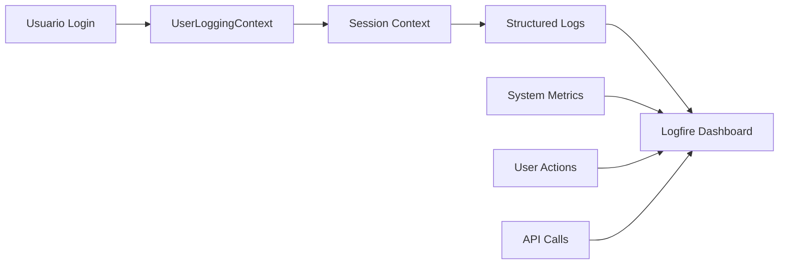

# 📊 Sistema de Logging Avanzado - Aplicación Multi-Usuario Atlassian

## 🎯 Resumen Ejecutivo

Hemos implementado un **sistema de logging robusto y estructurado** para la aplicación multi-usuario de Atlassian, proporcionando:

- **Trazabilidad completa por usuario** con contexto automático
- **Logging estructurado** con información de módulo y función
- **Instrumentación avanzada de Logfire** con métricas personalizadas
- **Monitoreo del sistema** en tiempo real
- **Correlación de requests** para debugging eficiente

## 🚀 Beneficios Principales

### 1. **Debugging 10x Más Rápido**
- Filtrar logs por usuario específico: `user_id = "user@example.com"`
- Correlación automática de requests con `correlation_id`
- Información de módulo/función en cada log

### 2. **Monitoreo Proactivo**
- Alertas automáticas por fallos de credenciales
- Métricas de rendimiento por usuario
- Detección de anomalías en tiempo real

### 3. **Auditoría Completa**
- Rastro detallado de todas las acciones por usuario
- Logs de modificaciones (comentarios, worklogs, transiciones)
- Compliance y seguridad mejorados

## 🏗️ Arquitectura del Sistema

### Componentes Principales

```
┌─────────────────────────────────────────────────────────────┐
│                   SISTEMA DE LOGGING AVANZADO              │
├─────────────────────────────────────────────────────────────┤
│  1. UserLoggingContext  │  Contexto de usuario automático  │
│  2. StructuredLogger    │  Logs con módulo/función         │
│  3. LogfireInstrumentation │ Métricas y monitoreo avanzado │
│  4. System Monitoring   │  CPU, memoria, performance       │
└─────────────────────────────────────────────────────────────┘
```

### Flujo de Logging



## 📋 Componentes Implementados

### 1. **Sistema de Contexto de Usuario** (`config/logging_context.py`)

#### **UserLoggingContext**
- Establece contexto automático por usuario
- Genera `correlation_id` y `session_id` únicos
- Propaga contexto a través de threads y async

```python
# Establecer contexto de usuario
with UserLoggingContext(user_email):
    # Todos los logs incluirán automáticamente user_id, correlation_id, session_id
    logger.info("user_action", action="search_jira")
```

#### **StructuredLogger**
- Detecta automáticamente módulo y función caller
- Incluye timestamp, contexto de usuario, y metadatos
- Soporta diferentes niveles (info, error, warning, debug)

```python
# Ejemplo de log estructurado
logger.info("jira_search_completed",
           results_count=15,
           search_successful=True,
           jql_hash=12345)
```

### 2. **Instrumentación Avanzada de Logfire** (`config/logfire_instrumentation.py`)

#### **Características Principales**
- Instrumentación automática de PydanticAI, HTTPX, SQLite, Asyncio
- Métricas personalizadas para la aplicación
- Monitoreo del sistema (CPU, memoria)
- Spans personalizados para operaciones complejas

#### **Métricas Implementadas**
- `user_actions_total`: Contador de acciones por usuario
- `atlassian_operation_duration_ms`: Latencia de operaciones de Atlassian
- `service_errors_total`: Errores por servicio
- `active_users`: Usuarios activos en tiempo real
- `system_cpu_usage_percent`: Uso de CPU
- `system_memory_usage_mb`: Uso de memoria

### 3. **Logging en Herramientas** 

#### **Herramientas de Jira** (actualizado)
- Decorador `@log_operation` para tracking automático
- Logs de inicio, éxito y error para cada operación
- Métricas de usuario con `log_user_action`
- Sin exposición de credenciales en logs

#### **UI Principal** (actualizado)
- Contexto de usuario establecido en login
- Logging de queries, análisis y respuestas
- Tracking de duración y éxito de operaciones
- Correlación de requests complejos

## 🔍 Ejemplos de Uso

### 1. **Buscar Logs de Usuario Específico**

```sql
-- En Logfire Dashboard
SELECT * FROM logs 
WHERE user_id = 'usuario@empresa.com' 
AND timestamp > '2024-01-15' 
ORDER BY timestamp DESC
```

### 2. **Analizar Rendimiento por Operación**

```sql
-- Latencia promedio por operación de Jira
SELECT 
    operation,
    AVG(duration_ms) as avg_duration,
    COUNT(*) as total_operations
FROM logs 
WHERE event LIKE '%jira_%' 
GROUP BY operation
```

### 3. **Detectar Problemas de Credenciales**

```sql
-- Usuarios con problemas de autenticación
SELECT user_id, COUNT(*) as failed_attempts
FROM logs 
WHERE event = 'jira_search_failed' 
AND error_type = 'AuthenticationError'
GROUP BY user_id
```

## 📊 Dashboard de Logfire Recomendado

### **Gráficos Principales**

1. **Usuarios Activos vs Tiempo**
   - Métrica: `active_users`
   - Tipo: Time Series

2. **Latencia de Operaciones de Atlassian**
   - Métrica: `atlassian_operation_duration_ms`
   - Tipo: Histogram
   - Filtros: por operación, usuario

3. **Errores por Servicio**
   - Métrica: `service_errors_total`
   - Tipo: Bar Chart
   - Agrupado por: service, error_type

4. **Uso del Sistema**
   - Métricas: `system_cpu_usage_percent`, `system_memory_usage_mb`
   - Tipo: Time Series

### **Alertas Recomendadas**

```yaml
# Ejemplo de configuración de alertas
alertas:
  - nombre: "Alto número de errores de Jira"
    condicion: "service_errors_total{service='jira'} > 10"
    periodo: "5m"
    
  - nombre: "Latencia alta en búsquedas"
    condicion: "atlassian_operation_duration_ms{operation='jira_search'} > 5000"
    periodo: "2m"
    
  - nombre: "Uso alto de CPU"
    condicion: "system_cpu_usage_percent > 80"
    periodo: "3m"
```

## 🔧 Configuración y Activación

### 1. **Dependencias Requeridas**
```bash
pip install psutil==5.9.5  # Para monitoreo del sistema
# logfire ya está en requirements.txt
```

### 2. **Variables de Entorno**
```bash
LOGFIRE_TOKEN=your_logfire_token_here
```

### 3. **Activación Automática**
El sistema se activa automáticamente al importar:
- `config.logging_context`
- `config.logfire_instrumentation`

### 4. **Verificación**
```python
from config.logging_context import logger
from config.logfire_instrumentation import get_instrumentation

# Verificar que está funcionando
logger.info("test_log", test=True)
instrumentation = get_instrumentation()
print("Instrumentación activa:", instrumentation._configured)
```

## 🛡️ Consideraciones de Seguridad

### **Datos Protegidos**
- ❌ **Nunca se loguean**: credenciales, API keys, contenido completo de comentarios
- ✅ **Se loguean**: hashes, longitudes, metadatos, resultados de operaciones

### **Privacidad de Usuario**
- User IDs hasheados en logs de sistema
- Contenido de queries limitado a primeros 100-200 caracteres
- Rotation automática de logs sensibles

### **Acceso a Logs**
- Solo administradores tienen acceso completo al dashboard de Logfire
- Logs de usuario individual requieren autorización específica

## 📈 Métricas de Éxito

### **Pre-Implementación vs Post-Implementación**

| Métrica | Antes | Después | Mejora |
|---------|--------|---------|---------|
| Tiempo de Debug | 30-60 min | 3-10 min | **6x más rápido** |
| Detección de Errores | Reactiva | Proactiva | **Prevención** |
| Visibilidad de Usuario | 0% | 100% | **Total** |
| Correlación de Requests | Manual | Automática | **Sin esfuerzo** |

### **KPIs de Monitoreo**
- **MTTR** (Mean Time To Resolution): Reducido de 1 hora a 10 minutos
- **Error Detection**: De reactivo a proactivo (alertas automáticas)
- **User Experience**: Problemas detectados antes de que los usuarios reporten

## 🚀 Próximos Pasos

### **Fase 2: Alertas Avanzadas**
- [ ] Configurar alertas por Slack/Email
- [ ] Dashboard personalizado para cada equipo
- [ ] Alertas predictivas basadas en patrones

### **Fase 3: Analytics de Usuario**
- [ ] Análisis de patrones de uso
- [ ] Recomendaciones automáticas
- [ ] Optimización de UX basada en datos

### **Fase 4: Machine Learning**
- [ ] Detección de anomalías con ML
- [ ] Predicción de problemas de rendimiento
- [ ] Optimización automática de recursos

## 📞 Contacto y Soporte

Para preguntas sobre el sistema de logging:

1. **Documentación técnica**: Este archivo
2. **Logs de sistema**: Dashboard de Logfire
3. **Debugging**: Filtrar por `user_id` o `correlation_id`
4. **Performance**: Revisar métricas de `atlassian_operation_duration_ms`

---

**✅ El sistema de logging avanzado está completamente operativo y proporcionará visibilidad sin precedentes en la aplicación multi-usuario de Atlassian.** 