# 🔄 Funcionalidades de Transiciones y Estados de Jira

## 📋 Resumen

Se han agregado nuevas funcionalidades al agente de Jira para consultar y gestionar transiciones y estados de issues. Estas herramientas permiten:

- ✅ **Consultar transiciones disponibles** para cualquier issue
- ✅ **Obtener todos los estados** del workflow de un proyecto
- ✅ **Ejecutar transiciones** para cambiar el estado de issues
- ✅ **Validar campos requeridos** antes de ejecutar transiciones

## 🛠️ Nuevas Funciones Implementadas

### 1. `get_issue_transitions(issue_key)`

**Propósito:** Obtiene todas las transiciones disponibles para un issue específico desde su estado actual.

**Parámetros:**
- `issue_key` (str): Clave del issue (ej. 'PROJ-123')

**Retorna:** `IssueTransitionsResult` con:
- Estado actual del issue
- Lista de transiciones disponibles
- Estados destino para cada transición
- Campos requeridos para cada transición

**Ejemplo de uso:**
```python
result = await get_issue_transitions("PSIMDESASW-6701")
print(f"Estado actual: {result.current_status.name}")
for transition in result.available_transitions:
    print(f"Transición: {transition.name} → {transition.to_status.name}")
```

### 2. `get_project_workflow_statuses(project_key)`

**Propósito:** Obtiene todos los estados disponibles en el workflow de un proyecto.

**Parámetros:**
- `project_key` (str): Clave del proyecto (ej. 'PROJ')

**Retorna:** `ProjectWorkflowInfo` con:
- Información del proyecto
- Lista completa de estados del workflow
- Categorías de estados

**Ejemplo de uso:**
```python
result = await get_project_workflow_statuses("PSIMDESASW")
print(f"Proyecto: {result.project_name}")
for status in result.all_statuses:
    print(f"Estado: {status.name} (Categoría: {status.category})")
```

### 3. `transition_issue(issue_key, transition_id, comment?, additional_fields?)`

**Propósito:** Ejecuta una transición específica en un issue.

**Parámetros:**
- `issue_key` (str): Clave del issue a transicionar
- `transition_id` (str): ID de la transición (obtenido de `get_issue_transitions`)
- `comment` (str, opcional): Comentario para la transición
- `additional_fields` (dict, opcional): Campos adicionales requeridos

**Retorna:** Diccionario con resultado de la operación

**Ejemplo de uso:**
```python
result = await transition_issue(
    issue_key="PSIMDESASW-6701",
    transition_id="21",
    comment="Iniciando trabajo en esta tarea"
)
print(f"Nuevo estado: {result['new_status']}")
```

## 📊 Nuevos Modelos Pydantic

### `JiraStatus`
```python
class JiraStatus(BaseModel):
    id: str
    name: str
    description: Optional[str] = None
    category_key: Optional[str] = None  # "new", "indeterminate", "done"
    category_name: Optional[str] = None
```

### `JiraTransition`
```python
class JiraTransition(BaseModel):
    id: str
    name: str
    to_status: JiraStatus
    has_screen: bool = False
    required_fields: List[JiraTransitionField] = []
```

### `IssueTransitionsResult`
```python
class IssueTransitionsResult(BaseModel):
    issue_key: str
    issue_summary: str
    current_status: JiraStatus
    available_transitions: List[JiraTransition]
    total_transitions: int
```

### `ProjectWorkflowInfo`
```python
class ProjectWorkflowInfo(BaseModel):
    project_key: str
    project_name: str
    workflow_name: Optional[str] = None
    all_statuses: List[WorkflowStatus]
    total_statuses: int
```

## 🎯 Casos de Uso Comunes

### 1. Consultar estados disponibles para un issue
```
Usuario: "¿A qué estados puedo mover la historia PSIMDESASW-6701?"
Agente: Usa get_issue_transitions() y muestra las opciones disponibles
```

### 2. Obtener todos los estados de un proyecto
```
Usuario: "¿Cuáles son todos los estados posibles en el proyecto PSIMDESASW?"
Agente: Usa get_project_workflow_statuses() y lista todos los estados
```

### 3. Mover un issue a otro estado
```
Usuario: "Mueve la tarea PSIMDESASW-6701 a En Progreso"
Agente: 
1. Usa get_issue_transitions() para obtener IDs de transición
2. Encuentra la transición que lleva a "En Progreso"
3. Usa transition_issue() con el ID correcto
```

### 4. Verificar campos requeridos antes de transición
```
Usuario: "¿Qué necesito completar para cerrar esta historia?"
Agente: Usa get_issue_transitions() y muestra los campos requeridos para la transición "Done"
```

## 🔧 Integración con el Agente

Las nuevas herramientas están completamente integradas en el agente principal:

### Herramientas agregadas:
- `get_issue_transitions_tool`
- `get_project_workflow_statuses_tool`
- `transition_issue_tool`

### System Prompt actualizado:
- Formato obligatorio para mostrar transiciones
- Instrucciones para usar transiciones de forma segura
- Flujo recomendado: consultar transiciones → ejecutar transición

## 📝 Formato de Salida del Agente

Cuando el agente muestra transiciones, usa este formato:

```markdown
**Estado actual:** To Do

**Transiciones disponibles:**
1. **Start Progress** (ID: 21)
   - **Estado destino:** In Progress
   - **Requiere pantalla:** No
   - **Campos requeridos:** Ninguno

2. **Done** (ID: 31)
   - **Estado destino:** Done
   - **Requiere pantalla:** Sí
   - **Campos requeridos:** Resolution
```

## 🧪 Pruebas

### Script de prueba: `test_transitions.py`

Ejecuta todas las funcionalidades nuevas:

```bash
python test_transitions.py
```

**Funciones probadas:**
- ✅ Obtener transiciones de un issue
- ✅ Obtener estados del workflow
- ✅ Simular transición (sin ejecutar)

### Configuración de pruebas:

Antes de ejecutar, modifica estos valores en `test_transitions.py`:
```python
test_issue_key = "TU-ISSUE-123"      # Cambia por un issue real
test_project_key = "TU-PROYECTO"     # Cambia por tu proyecto
```

## ⚠️ Consideraciones Importantes

### Seguridad:
- **`transition_issue` modifica datos reales** en Jira
- Siempre consulta transiciones disponibles antes de ejecutar
- Valida campos requeridos antes de transicionar

### Permisos:
- El usuario debe tener permisos para ver transiciones
- El usuario debe tener permisos para ejecutar transiciones específicas
- Algunos estados pueden requerir permisos especiales

### Flujo recomendado:
1. **Consultar** transiciones disponibles con `get_issue_transitions`
2. **Validar** que la transición deseada existe
3. **Verificar** campos requeridos
4. **Ejecutar** transición con `transition_issue`

## 🚀 Ejemplos de Interacción con el Agente

### Ejemplo 1: Consultar transiciones
```
Usuario: "¿Qué transiciones están disponibles para PSIMDESASW-6701?"

Agente: [Usa get_issue_transitions y muestra formato estructurado]
```

### Ejemplo 2: Cambiar estado
```
Usuario: "Mueve PSIMDESASW-6701 a In Progress"

Agente: 
1. Consulta transiciones disponibles
2. Encuentra la transición "Start Progress"
3. Ejecuta la transición
4. Confirma el nuevo estado
```

### Ejemplo 3: Estados del proyecto
```
Usuario: "¿Cuáles son todos los estados en el proyecto PSIMDESASW?"

Agente: [Usa get_project_workflow_statuses y lista todos los estados]
```

## 📈 Beneficios

- ✅ **Visibilidad completa** de estados y transiciones
- ✅ **Automatización** de cambios de estado
- ✅ **Validación** de campos requeridos
- ✅ **Integración perfecta** con el flujo de trabajo existente
- ✅ **Seguridad** mediante validación previa
- ✅ **Flexibilidad** para diferentes workflows de proyecto

## 🔄 Flujo de Trabajo Típico

```mermaid
graph TD
    A[Usuario solicita cambio de estado] --> B[get_issue_transitions]
    B --> C{¿Transición disponible?}
    C -->|Sí| D[Verificar campos requeridos]
    C -->|No| E[Informar que no es posible]
    D --> F[transition_issue]
    F --> G[Confirmar nuevo estado]
    E --> H[Mostrar transiciones disponibles]
```



---

**Implementado por:** Sistema de Agentes IA  
**Fecha:** Enero 2025  
**Versión:** 1.0.0 