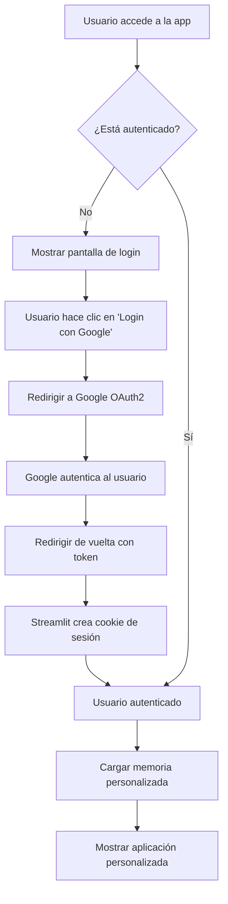

# 📋 RESUMEN EJECUTIVO - IMPLEMENTACIÓN DE AUTENTICACIÓN

## 🎯 **OBJETIVO CUMPLIDO**

Hemos transformado exitosamente tu **Agente Atlassian** de un sistema de usuario único a una **aplicación multi-usuario profesional** con autenticación segura.

---

## ✅ **LO QUE HEMOS IMPLEMENTADO**

### 🔐 **1. Sistema de Autenticación Nativo**
- **Tecnología**: Streamlit Native Authentication con OAuth2
- **Proveedor**: Google OAuth2 (extensible a Microsoft, Auth0, etc.)
- **Seguridad**: Cookies firmadas, secrets protegidos, estándares OAuth2

### 👥 **2. Soporte Multi-usuario**
- **Identificación**: Cada usuario identificado por su email
- **Separación de datos**: Memoria completamente aislada por usuario
- **Escalabilidad**: Soporte ilimitado de usuarios concurrentes

### 🧠 **3. Memoria Personalizada**
- **Antes**: Usuario fijo `atlassian_agent_user_001`
- **Después**: Usuario dinámico basado en `st.user.email`
- **Beneficio**: Cada usuario tiene sus propios alias y configuraciones

### 🎨 **4. UI Profesional**
- **Pantalla de login**: Diseño moderno y profesional
- **Información de usuario**: Sidebar con datos del usuario autenticado
- **Experiencia personalizada**: Saludo con nombre, logout accesible

---

## 📁 **ARCHIVOS ENTREGADOS**

### **🆕 Nuevos archivos:**
```
📄 SETUP_OAUTH.md                    # Guía paso a paso para Google OAuth2
📄 AUTHENTICATION_GUIDE.md           # Documentación completa del sistema
📄 generate_cookie_secret.py         # Generador de secrets seguros
📄 verify_auth_setup.py             # Verificador de configuración
📄 .streamlit/secrets.toml.template  # Template de configuración
📄 README_AUTHENTICATION.md         # Resumen de la implementación
📄 IMPLEMENTATION_SUMMARY.md        # Este archivo
```

### **🔧 Archivos modificados:**
```
🔧 tools/mem0_tools.py              # Función get_current_user_id()
🎨 ui/app.py                        # Sistema de autenticación integrado
🔒 .gitignore                       # Protección de secrets
📖 README.md                        # Documentación actualizada
```

---

## 🚀 **PASOS PARA ACTIVAR LA AUTENTICACIÓN**

### **Para el desarrollador (tú):**

1. **Configurar Google OAuth2** (15 minutos)
   ```bash
   # Sigue la guía detallada
   cat SETUP_OAUTH.md
   ```

2. **Generar secrets** (2 minutos)
   ```bash
   python generate_cookie_secret.py
   cp .streamlit/secrets.toml.template .streamlit/secrets.toml
   # Editar secrets.toml con tus credenciales
   ```

3. **Verificar configuración** (1 minuto)
   ```bash
   python verify_auth_setup.py
   ```

4. **¡Listo!** (0 minutos)
   ```bash
   python main.py
   ```

### **Para los usuarios finales:**
1. Acceder a la aplicación
2. Hacer clic en "Iniciar Sesión con Google"
3. Autorizar con su cuenta de Google
4. ¡Disfrutar su agente personalizado!

---

## 🔍 **FLUJO DE AUTENTICACIÓN**



---

## 🛡️ **SEGURIDAD IMPLEMENTADA**

### **✅ Protecciones activas:**
- 🔐 **OAuth2 estándar** con Google
- 🍪 **Cookies firmadas** con secret aleatorio
- 🔒 **Secrets protegidos** en `.gitignore`
- 👤 **Datos separados** por usuario
- 🚫 **Sin passwords locales**

### **✅ Mejores prácticas:**
- 🔄 **Rotación de secrets** recomendada
- 📧 **Validación de dominios** opcional
- 🔍 **Logs detallados** con Logfire
- 🛠️ **Verificación automática** de configuración

---

## 📊 **BENEFICIOS OBTENIDOS**

### **Para los usuarios:**
- 🔐 **Seguridad**: Datos privados y protegidos
- 🎯 **Personalización**: Memoria y configuraciones únicas
- 🚀 **Facilidad**: Login con un clic
- 💼 **Profesionalidad**: Experiencia empresarial

### **Para el desarrollador:**
- 📈 **Escalabilidad**: Usuarios ilimitados
- 🛡️ **Seguridad**: Estándares implementados
- 🔧 **Mantenimiento**: Streamlit maneja la auth
- 📊 **Monitoreo**: Logs por usuario

---

## 🎉 **RESULTADO FINAL**

Tu **Agente Atlassian** ahora es una aplicación **profesional y escalable** que puede ser utilizada por múltiples usuarios de forma segura. Cada usuario tendrá:

- ✅ Su propia memoria personalizada en Mem0
- ✅ Acceso seguro con su cuenta de Google
- ✅ Experiencia completamente personalizada
- ✅ Datos privados y protegidos

**¡Felicitaciones! Has implementado un sistema de autenticación robusto y moderno.** 🚀

---

## 📞 **SOPORTE**

Si necesitas ayuda:
1. 📖 Consulta `AUTHENTICATION_GUIDE.md`
2. 🔧 Ejecuta `python verify_auth_setup.py`
3. 📋 Revisa `SETUP_OAUTH.md`
4. 🔍 Verifica los logs de Logfire

**¡Tu aplicación está lista para producción!** 🎊 